# Module 2 – Analytics Pipeline

This module uses the Titanic dataset to complete exploratory data analysis, classification and regression in one connected workflow.

The analysis is divided into two ordered scripts:

1. `01_eda.py` loads the dataset once, saves the offline CSV, cleans the data and creates the exploratory analysis.
2. `02_modeling.py` reads the saved cleaned data, trains and evaluates the models, and saves the complete fitted pipeline.

## Setup and execution

From the repository root:

```bash
python -m venv .venv
source .venv/bin/activate
pip install -r analytics/requirements.txt
python analytics/run_all.py
```

On Windows, activate the environment with `.venv\Scripts\activate`.

The remaining sections contain the measured results and interpretations from the completed run.

## Files

```text
analytics/
├── 01_eda.py
├── 02_modeling.py
├── run_all.py
├── predict_example.py
├── requirements.txt
├── titanic.csv
├── titanic_clean.csv
├── best_pipeline.joblib
└── output/
    ├── charts/
    ├── 01_profile.txt
    ├── 07_classification_metrics.csv
    ├── 08_imbalance_comparison.csv
    ├── 09_regression_metrics.csv
    ├── 10_model_comparison.csv
    ├── eda_summary.json
    └── modeling_summary.json
```

`titanic.csv` is the original offline fallback saved immediately after the only call to `sns.load_dataset("titanic")`. The modeling script does not download the dataset again. It reads `titanic_clean.csv`, which was produced from the same original DataFrame by the EDA script.

## Dataset profile and missing values

The original dataset has 891 rows and 15 columns. The complete `df.info()`, `df.describe()` and shape output is stored in `output/01_profile.txt`.

| Column | Missing percentage | Decision |
| --- | ---: | --- |
| `age` | 19.87% | This is between 5% and 30%, so the values were imputed with the median age. |
| `embarked` | 0.22% | This is below 5%, so the two affected rows were removed. |
| `embark_town` | 0.22% | This is below 5%. The same two rows were already removed using the threshold rule. |
| `deck` | 77.22% | This is too high for reliable imputation, so the column was removed. |

After cleaning, the dataset contains 889 rows and 14 columns. Median imputation was appropriate for `age` because it keeps the available rows and is less affected by extreme ages than the mean. The `deck` column was removed because filling more than three quarters of it would introduce too many assumed values.

## Univariate analysis

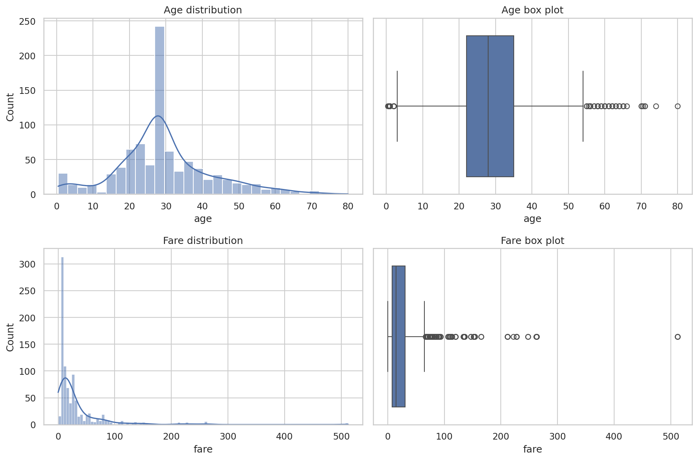

Using the IQR rule, `age` has 65 outliers outside the range 2.50 to 54.50. `fare` has 114 outliers outside the range -26.76 to 65.66. These values were reported rather than removed because unusually high fares and ages may represent genuine passengers and may contain useful information.

The mean fare is 32.10, the median is 14.45 and the mode is 8.05. Since mean > median > mode, the fare distribution is right-skewed. The histogram and box plot also show a long upper tail caused by a smaller number of expensive tickets.

## Survival rates using boolean masks

| Sex | Survival rate |
| --- | ---: |
| Female | 74.04% |
| Male | 18.89% |

| Passenger class | Survival rate |
| --- | ---: |
| First | 62.62% |
| Second | 47.28% |
| Third | 24.24% |

| Sex and class | Survival rate |
| --- | ---: |
| Female, first class | 96.74% |
| Female, second class | 92.11% |
| Female, third class | 50.00% |
| Male, first class | 36.89% |
| Male, second class | 15.74% |
| Male, third class | 13.54% |

The calculations in `01_eda.py` use boolean masks with `&` to combine sex and passenger class conditions. The full values are also saved in CSV format in the output directory.

## Multivariate data story

### Chart 1 – Survival by sex

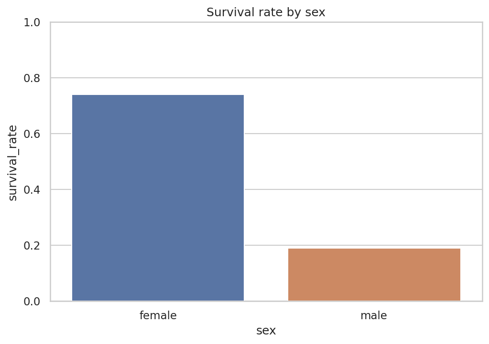

Female passengers had a survival rate of 74.04%, compared with 18.89% for male passengers. This is the largest visible difference between the main passenger groups and suggests that sex was strongly related to the rescue outcome.

### Chart 2 – Survival by passenger class

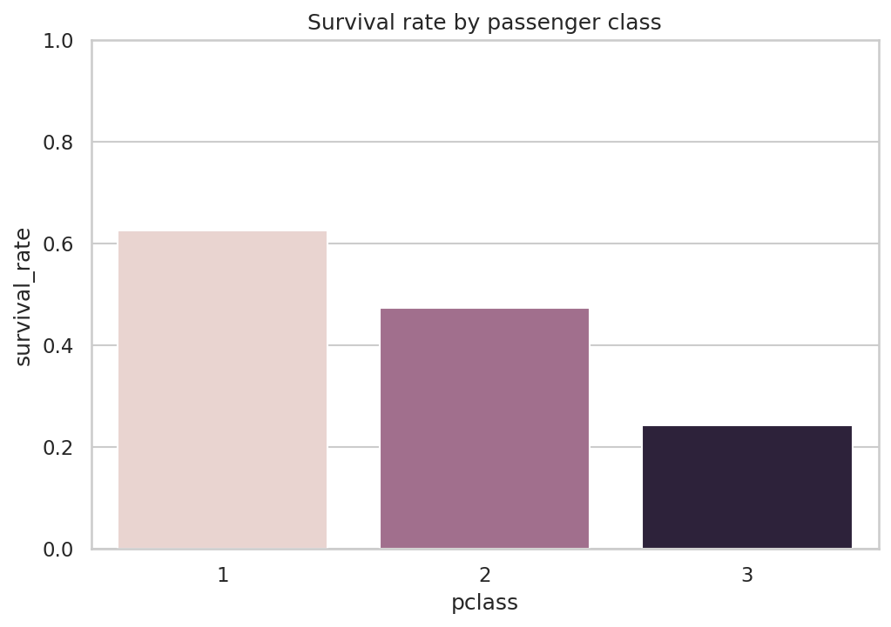

First-class passengers had the highest survival rate at 62.62%, followed by second class at 47.28% and third class at 24.24%. This pattern suggests that cabin location, access to lifeboats or other class-related advantages affected the outcome.

### Chart 3 – Survival by sex and passenger class

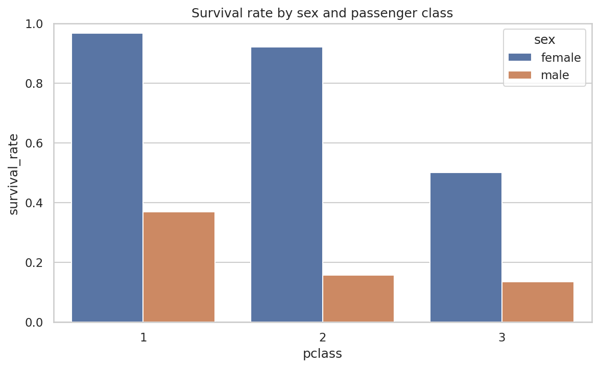

Sex and class together provide a clearer story than either feature alone. First-class and second-class women had survival rates above 92%, while third-class men had the lowest rate at 13.54%. Female passengers had an advantage in every class, but third-class women still had a much lower survival rate than women in the first two classes.

### Chart 4 – Age and survival

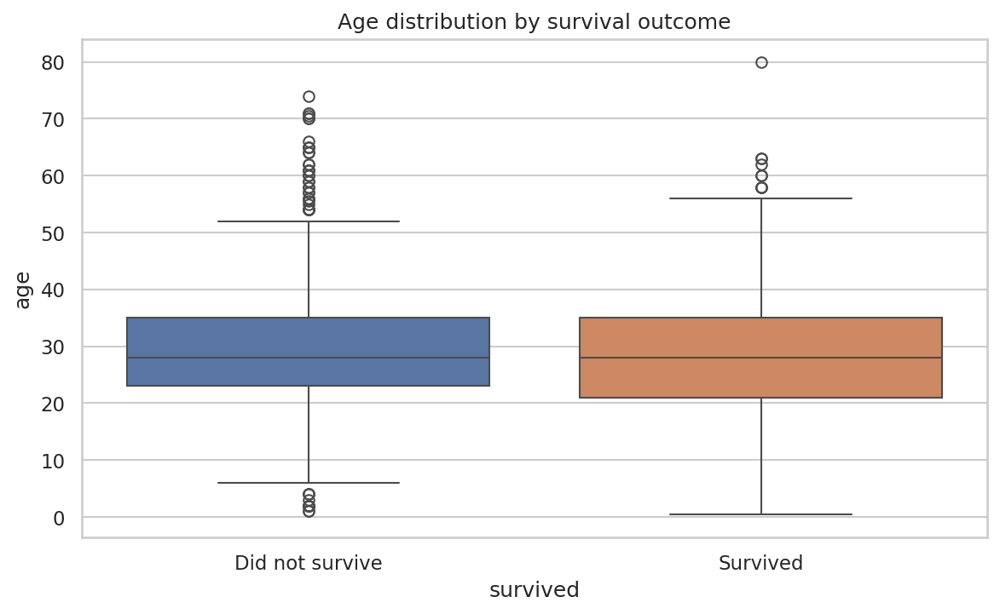

The age distributions of survivors and non-survivors overlap considerably, so age alone does not clearly separate the two outcomes. The survivor group contains some younger passengers, but the wide overlap shows that age should be considered together with sex, class and family information.

### Chart 5 – Fare and survival

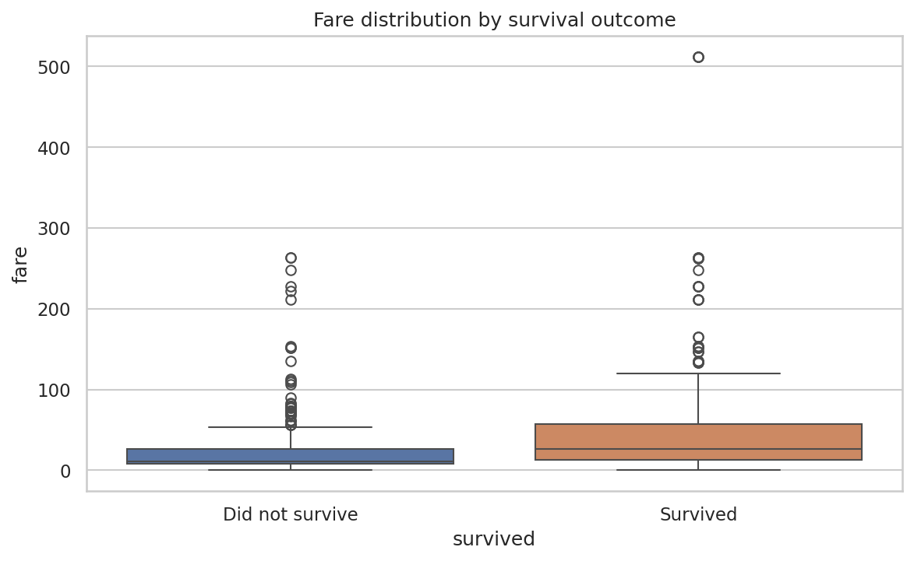

Survivors generally paid higher fares than passengers who did not survive. Fare is related to passenger class, so this chart supports the earlier finding that passengers with higher-class tickets had better survival outcomes. The large number of high-fare outliers also explains the long upper range in both groups.

## Correlation analysis

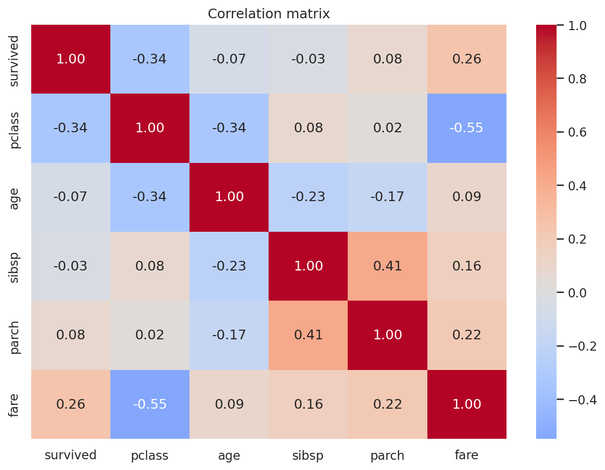

The correlation matrix uses exactly these six columns: `survived`, `pclass`, `age`, `sibsp`, `parch` and `fare`. The derived boolean columns `adult_male` and `alone` were intentionally excluded.

The two largest absolute off-diagonal correlations are:

1. `pclass` and `fare`: -0.548. Lower numerical class values represent better passenger classes, so the negative result means first-class passengers generally paid higher fares.
2. `sibsp` and `parch`: 0.415. Passengers travelling with a spouse or sibling were also more likely to be travelling with parents or children, which reflects family travel groups.

## Standardization check

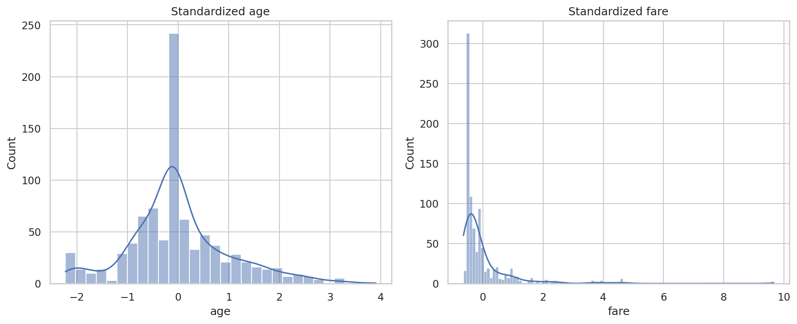

Before standardization, `age` had a mean of 29.32 and standard deviation of 12.98, while `fare` had a mean of 32.10 and standard deviation of 49.70. After applying the z-score formula, both columns have a mean approximately equal to 0 and a standard deviation equal to 1. This was an EDA check only; the modeling pipelines fit their own scaler using training data only.

## Train and test split

The cleaned target contains 549 non-survivors (61.75%) and 340 survivors (38.25%). An 80/20 stratified split produced 711 training rows and 178 test rows. Stratification was used because the classes are not evenly balanced, and it keeps approximately the same survivor ratio in both sets.

The split is performed before preprocessing. Numeric features are median-imputed and standardized, while `sex` and `embarked` are most-frequent-imputed and one-hot encoded. All these steps are placed inside a `ColumnTransformer` and `Pipeline`, so they are fitted only on the training data and applied to the test data without refitting.

## Classification results

| Model | Accuracy | Precision | Recall | F1 | AUC |
| --- | ---: | ---: | ---: | ---: | ---: |
| Logistic Regression | 0.8090 | 0.7833 | 0.6912 | 0.7344 | 0.8610 |
| Decision Tree | 0.7640 | 0.7600 | 0.5588 | 0.6441 | 0.8374 |
| Random Forest | 0.8090 | 0.7656 | 0.7206 | 0.7424 | 0.8196 |

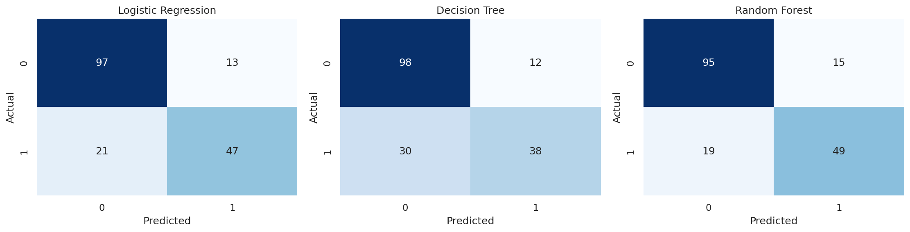

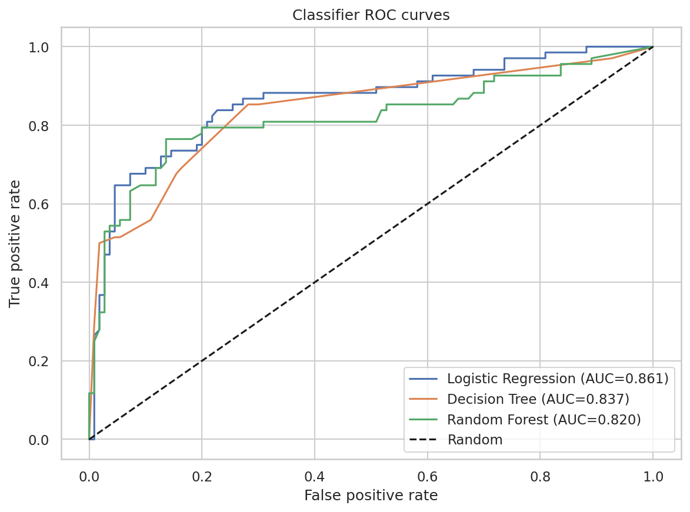

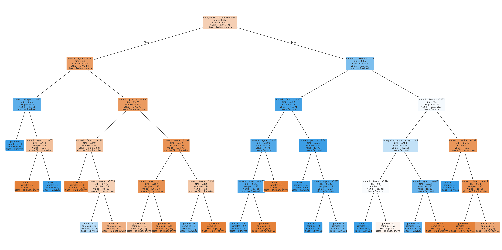

The three models use the same training and test rows. Random Forest achieved the highest F1 score, while Logistic Regression achieved the highest AUC. The labeled decision-tree chart shows the rules learned from the transformed feature names and the two outcome classes.

## Imbalance handling

| Method | Precision | Recall | F1 |
| --- | ---: | ---: | ---: |
| Baseline | 0.7833 | 0.6912 | 0.7344 |
| Balanced class weights | 0.7183 | 0.7500 | 0.7338 |
| SMOTE on training data | 0.7353 | 0.7353 | 0.7353 |

SMOTE was applied only after splitting the data and only to the transformed training fold. It produced the highest F1 score of the three imbalance approaches, although the difference from the baseline was small. Balanced class weights gave the highest recall but reduced precision, showing the trade-off between finding more survivors and creating more false-positive survivor predictions.

## Random Forest tuning

`GridSearchCV` tested `n_estimators`, `max_depth` and `max_features` using five-fold cross-validation. The best parameters were:

```text
max_depth = 4
max_features = sqrt
n_estimators = 200
```

The best cross-validation F1 score was 0.7448. The tuned Random Forest was created with `oob_score=True` and produced an OOB score of 0.8172. On the held-out test data it achieved 0.8202 accuracy, 0.8333 precision, 0.6618 recall, 0.7377 F1 and 0.8376 AUC.

## Fare regression

The regression task predicts `fare` using survival, class, age, family counts, sex and embarkation port. It uses a separate train/test split and a complete preprocessing pipeline.

| Model | MAE | RMSE | R² | Adjusted R² |
| --- | ---: | ---: | ---: | ---: |
| Linear Regression | 21.0986 | 41.7021 | 0.3482 | 0.3091 |

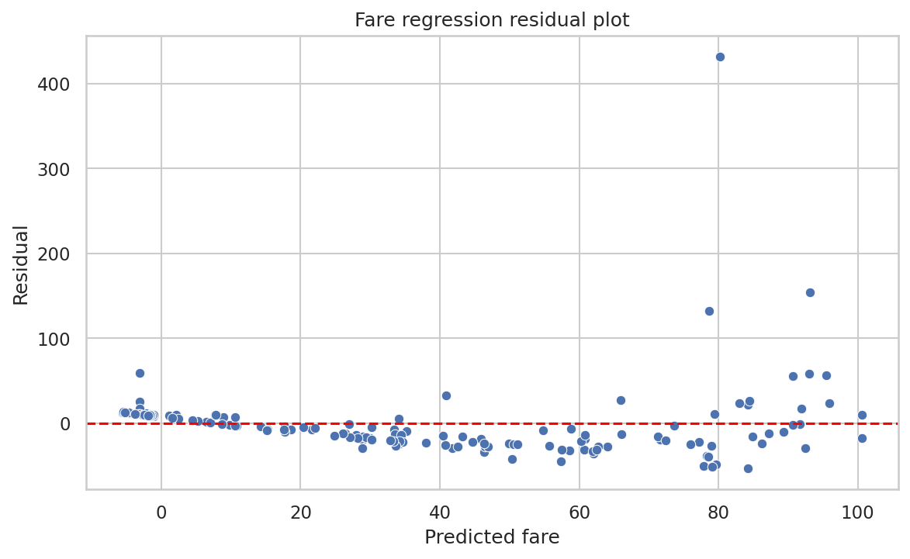

The residual plot shows that prediction errors spread out more as the predicted fare increases. The Spearman correlation between absolute residual size and predicted fare is 0.5174, so the analysis finds evidence of heteroscedasticity. This means the linear model is less consistent for higher fares and does not capture all of the non-linear pricing pattern.

## Final comparison and recommendation

Classification and regression results are stored as separate metric groups in `output/10_model_comparison.csv`. Classification scores describe survival prediction, whereas MAE, RMSE and R² describe fare prediction, so the two groups should not be compared as if they use the same scale.

I would deploy the original Random Forest classification pipeline because it achieved the highest test F1 score of 0.7424 and the highest recall among the three main classifiers at 0.7206, while maintaining 0.8090 accuracy. Logistic Regression had the strongest AUC at 0.8610 and is easier to explain, so it would be a reasonable alternative when interpretability is the main priority. The Decision Tree had the lowest F1 score and recall, making it the weakest choice for this dataset. Before production use, the selected model should still be monitored for changes in class balance and performance on new data.

## Saved pipeline and reload test

`best_pipeline.joblib` contains both the fitted preprocessing steps and the selected Random Forest estimator. It accepts raw input columns directly, including unscaled numeric values and unencoded category text. The module reloads the file and confirms that its predictions match the original pipeline.

To run the separate reload example:

```bash
python analytics/predict_example.py
```
